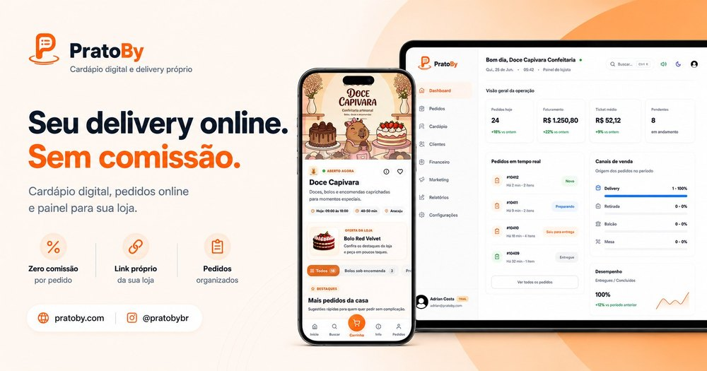

<div align="center">
  
  <h2>Developer · Information Systems Student · Former Military</h2>
  <p>
    <a href="https://pratoby.com" target="_blank">
      
    </a>&nbsp;
    <a href="https://linkedin.com/in/adrian-costa-85b107277" target="_blank">
      
    </a>&nbsp;
    <a href="https://discordapp.com/users/adriiancoe" target="_blank">
      
    </a>&nbsp;
    <a href="https://instagram.com/AdriianCOE" target="_blank">
      
    </a>&nbsp;
    <a href="mailto:tommycramos@gmail.com" target="_blank">
      
    </a>&nbsp;
    
  </p>
</div>

<br/>

<table>
<tr>
<td width="32%" align="center" valign="middle">
  
</td>
<td width="68%" valign="middle">

```txt
Profile ver. 2.0
────────────────────────────────────────────────────────────
Name........: Adrian Costa · @AdriianCOE
Role........: Indie developer · Information Systems student
Location....: Aracaju, Brazil
Background..: Former soldier — 28th Hunters Battalion, Brazilian Army
Building....: PratoBy — digital menu & ordering SaaS, solo end-to-end
Side quests.: DayZ world-building · Hearts of Iron IV total conversions
Stack.......: React · Vite · Tailwind CSS · Firebase · Cloud Functions
Focus.......: Product · frontend · backend · payments · security · infra
```

</td>
</tr>
</table>

<br/>

## Projects

<table>
<tr>
<td width="44%" align="center" valign="middle">
  <a href="https://pratoby.com" target="_blank">
    
  </a>
</td>
<td width="56%" valign="top">

**[PratoBy](https://pratoby.com)** — digital menu & ordering SaaS

Lets restaurants sell without marketplace commissions. Full ownership of product, frontend, backend, payments, security and infrastructure.


<sub>Closed-source · live in production</sub>

</td>
</tr>

<tr>
<td width="44%" align="center" valign="middle">
  <a href="https://github.com/AdriianCOE/Noronha">
    
  </a>
</td>
<td width="56%" valign="top">

**[Fernando de Noronha](https://steamcommunity.com/sharedfiles/filedetails/?id=3682451894)** — 1:1 scale map for *DayZ*

Geographic fidelity, tropical atmosphere and open-world optimization. Built as the first fully Brazilian map for the game.

`DayZ Workbench` · `Terrain Builder` · `Enfusion Script` · `Blender`

</td>
</tr>

<tr>
<td width="44%" align="center" valign="middle">
  <a href="https://github.com/AdriianCOE/Azarya">
    
  </a>
</td>
<td width="56%" valign="top">

**[Azarya](https://steamcommunity.com/sharedfiles/filedetails/?id=3505750217)** — total conversion for *Hearts of Iron IV*

An original universe with dozens of countries, campaigns, events and custom systems written from scratch.

`Paradox Script` · `GUI Modding` · `Game Design` · `Worldbuilding`

</td>
</tr>
</table>

<br/>

<p align="center">
  
  
</p>

<p align="center">
  
</p>

<br/>
<p align="center"></p>
<br/>

<p align="center">
  
  <br/><br/>
  <i>"Live to fight another day, boys."</i> — <b>Hardcase</b>
  <br/><br/>
  <sub><i>Products in continuous evolution.</i></sub>
</p>
