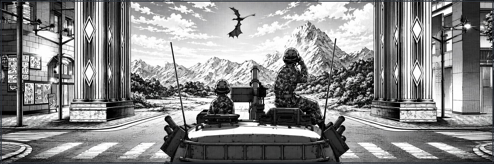
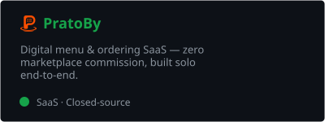

<div align="center">




<p>I build digital products, fictional worlds and game experiences.</p>

<p>
  <a href="https://pratoby.com">
    
  </a>
  <a href="https://discordapp.com/users/adriiancoe">
    
  </a>
  <a href="https://instagram.com/AdriianCOE">
    
  </a>
  <a href="mailto:tommycramos@gmail.com">
    
  </a>
  <a href="https://ko-fi.com/M5U123Y4S4">
    
  </a>
</p>


</div>

<p align="center">
  
</p>

## About me

<table align="center">
<tr>
<td width="24%" align="center" valign="middle">
  
</td>
<td width="76%" valign="middle">

```txt
─── adriancosta.dev ───────────────────────────────────

Name........: Adrian Costa · @AdriianCOE
Location....: Aracaju, Sergipe · Brazil
Role........: Indie Developer · Product Builder
Education...: Systems Analysis & Development
Current.....: Building PratoBy
Background..: Former Brazilian Army soldier · 28º BC
Stack.......: React · Vite · Tailwind · Firebase · Node.js
Focus.......: Product · Frontend · Backend · Security
Side quests.: DayZ · Hearts of Iron IV · Worldbuilding
```

</td>
</tr>
</table>


## Featured projects

<table>
<tr>
<td width="42%" align="center" valign="middle">
  <a href="https://pratoby.com">
    
  </a>
</td>
<td width="58%" valign="middle">

### [PratoBy](https://pratoby.com)

**Digital menu and ordering SaaS for restaurants.**

Independent storefronts, digital menus and order management without marketplace commissions.


</td>
</tr>

<tr>
<td width="42%" align="center" valign="middle">
  <a href="https://github.com/AdriianCOE/Noronha">
    
  </a>
</td>
<td width="58%" valign="middle">

### [Fernando de Noronha](https://steamcommunity.com/sharedfiles/filedetails/?id=3682451894)

**A 1:1 scale Brazilian map for DayZ.**

A recreation of the archipelago focused on geographic fidelity, tropical atmosphere and open-world performance.


</td>
</tr>

<tr>
<td width="42%" align="center" valign="middle">
  <a href="https://github.com/AdriianCOE/Azarya">
    
  </a>
</td>
<td width="58%" valign="middle">

### [Azarya](https://steamcommunity.com/sharedfiles/filedetails/?id=3505750217)

**A total-conversion mod for Hearts of Iron IV.**

An original universe with custom nations, political campaigns, characters, conflicts and gameplay systems.


</td>
</tr>
</table>

<p align="center">
  
</p>

## GitHub activity

<table align="center">
<tr>
<td align="center">
  
</td>
<td align="center">
  
</td>
</tr>
</table>

<p align="center">
  
</p>

</div>

<p align="center">
  
</p>

<div align="center">

### Support my work

Supporting me helps fund hosting, development tools, assets and independent projects.

<a href="https://ko-fi.com/M5U123Y4S4">
  
</a>

<p align="center" style="margin-top: 24px; margin-bottom: 0;">
  <i>"Live to fight another day, boys."</i> — <b>Hardcase</b>
</p>

<p align="center" style="margin-top: 4px; margin-bottom: 40px;">
  
</p>


<p align="center">
  
</p>
