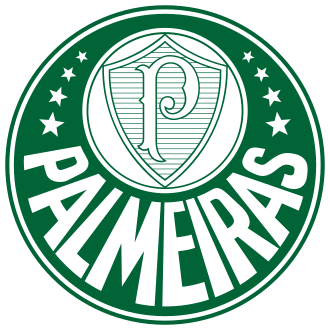

 

  DESENVOLVEDOR FULL STACK · ANÁLISE E DESENVOLVIMENTO DE SISTEMAS · EX-MILITAR

  

  

## Eu.!

Antes de trabalhar com software, servi no **Exército Brasileiro**, no **28º Batalhão de Caçadores**.

O que trouxe da caserna não foi retórica, mas uma forma de trabalhar: planejar antes de agir, assumir responsabilidade pelo resultado e continuar funcionando sob pressão.

Hoje curso **Análise e Desenvolvimento de Sistemas** e desenvolvo produtos próprios de ponta a ponta. Sou o único desenvolvedor por trás do [**PratoBy**](https://pratoby.com), da interface à infraestrutura.

Fora do desenvolvimento web, construo mundos, mapas e sistemas para jogos — projetos que combinam programação, pesquisa, design e execução de longo prazo.

 

## Projetos

### [PratoBy](https://pratoby.com)

PLATAFORMA SAAS · PRODUTO PRINCIPAL

Cardápio digital e sistema de pedidos para restaurantes, padarias e confeitarias venderem diretamente ao cliente, sem comissão de marketplace.

Desenvolvo o produto completo: interface, backend, regras de negócio, cobrança, segurança e infraestrutura. O principal desafio está no que não aparece — controle de planos, processamento de pedidos, SEO por loja e uma arquitetura serverless que precisa permanecer confiável sem elevar o custo operacional.

`React` `Vite` `Tailwind CSS` `Firebase` `Cloud Functions`

 

### [Fernando de Noronha](https://steamcommunity.com/sharedfiles/filedetails/?id=3682451894)

MOD PARA DAYZ · ARQUIPÉLAGO EM ESCALA 1:1

Recriação de Fernando de Noronha dentro do universo de sobrevivência do DayZ, preservando a topografia, a ambientação tropical e pontos geográficos reconhecíveis.

O trabalho envolve terreno, vegetação, colisões, texturas, assets brasileiros e otimização de um ambiente aberto denso — equilibrando fidelidade geográfica, navegação e fluidez de gameplay.

`DayZ Workbench` `Terrain Builder` `Enfusion Script` `Blender`

 

  
   
  O arquipélago real por trás do mod.

 

### [Azarya](https://steamcommunity.com/sharedfiles/filedetails/?id=3505750217)

CONVERSÃO TOTAL · HEARTS OF IRON IV

Universo original com dezenas de países, personagens, conflitos, árvores de foco, eventos e sistemas próprios de campanha.

O projeto combina programação orientada a dados, design de sistemas, interface, narrativa e worldbuilding dentro das limitações da engine e da estrutura de modding da Paradox.

`Paradox Script` `GUI Modding` `Game Design` `Worldbuilding`

  

  <a href="https://discordapp.com/users/adriiancoe">Discord</a>
  &nbsp;·&nbsp;
  <a href="https://instagram.com/AdriianCOE">Instagram</a>

APÊNDICE · ATIVIDADE

  

  
   
  Este perfil acompanha o avanço dos projetos — não uma versão final deles.

